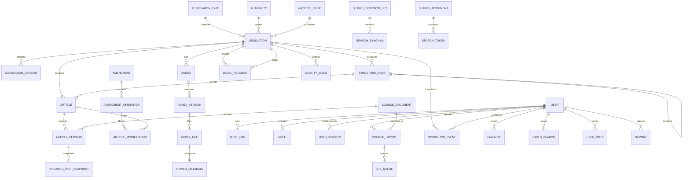

# ERD — المرحلة الأساسية

```mermaid
erDiagram
  LEGISLATION_TYPE ||--o{ LEGISLATION : classifies
  AUTHORITY ||--o{ LEGISLATION : issues
  GAZETTE_ISSUE ||--o{ LEGISLATION : publishes
  LEGISLATION ||--o{ LEGISLATION_VERSION : versions
  LEGISLATION ||--o{ STRUCTURE_NODE : structures
  STRUCTURE_NODE ||--o{ STRUCTURE_NODE : contains
  LEGISLATION ||--o{ ARTICLE : contains
  STRUCTURE_NODE ||--o{ ARTICLE : groups
  ARTICLE ||--o{ ARTICLE_VERSION : versions
  SOURCE_DOCUMENT ||--o{ ARTICLE_VERSION : proves
  AMENDMENT ||--o{ AMENDMENT_OPERATION : contains
  AMENDMENT_OPERATION ||--o{ ARTICLE_MODIFICATION : affects
  ARTICLE ||--o{ ARTICLE_MODIFICATION : target
  ARTICLE_VERSION ||--o{ PREVIOUS_TEXT_SNAPSHOT : snapshots
  LEGISLATION ||--o{ ANNEX : has
  ANNEX ||--o{ ANNEX_VERSION : versions
  ANNEX_VERSION ||--o{ ANNEX_FILE : files
  ANNEX_FILE ||--|| VIEWER_METADATA : configures
  LEGISLATION ||--o{ LEGAL_RELATION : source
  LEGISLATION ||--o{ LEGAL_RELATION : target
  USER ||--o{ AUDIT_LOG : acts
  USER }o--o{ ROLE : receives
  USER ||--o{ USER_SESSION : authenticates
  USER ||--o{ SOURCE_IMPORT : uploads
  SOURCE_DOCUMENT ||--o{ SOURCE_IMPORT : imported_as
  SOURCE_IMPORT ||--o{ JOB_QUEUE : queues
  LEGISLATION ||--o{ QUALITY_ISSUE : checks
  LEGISLATION ||--o{ WORKFLOW_EVENT : transitions
  USER ||--o{ WORKFLOW_EVENT : performs
  SEARCH_SYNONYM_SET ||--o{ SEARCH_SYNONYM : versions
  SEARCH_DOCUMENT ||--o{ SEARCH_TOKEN : positions
  USER ||--o{ FAVORITE : stores
  USER ||--o{ SAVED_SEARCH : saves
  USER ||--o{ USER_NOTE : writes
  USER ||--o{ REPORT : reports
```

المعرّفات UUID (`CHAR(36)`)، وكل التواريخ القانونية `DATE`. قواعد الفترات الزمنية ومناعة النسخ المنشورة تطبقها الترحيلات داخل MariaDB إضافة إلى معاملة الخدمة.
